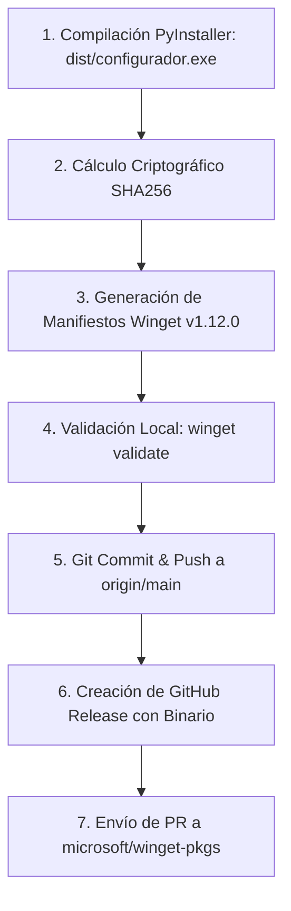

# Publish Release & Dual Distribution Skill

Esta skill proporciona la automatización integral de **publicación dual** para Windows 11 Configurator (tanto en **GitHub Releases** como en el catálogo oficial de **Microsoft Winget** en `microsoft/winget-pkgs`).

---

## ⚡ 1. Flujo de Ejecución Rápida

Cuando el usuario diga **"súbelo"**, **"crea una nueva versión"** o **"publica el release"**, ejecuta el script maestro automatizado:

```powershell
# 1. Publicación dual completa (calcula automáticamente la siguiente versión patch):
python .agents/skills/publish-release/scripts/publish_release.py

# 2. Publicación con versión y notas explícitas:
python .agents/skills/publish-release/scripts/publish_release.py --version 1.0.4 --title "v1.0.4: Fixes y optimizaciones" --notes "Notas de versión..."

# 3. Modo simulación (Dry Run):
python .agents/skills/publish-release/scripts/publish_release.py --dry-run
```

---

## 🏗️ 2. Fases del Pipeline Automatizado



### Paso 1: Compilación de `dist/configurador.exe`
- Invoca `src/build_exe.py` para generar el binario autónomo `dist/configurador.exe` con todas las subdependencias empaquetadas.

### Paso 2: Cálculo de Hash SHA256
- Lee el binario compilado y calcula su hash criptográfico SHA256 en mayúsculas.

### Paso 3: Generación de Manifiestos Multi-Archivo v1.12.0
Crea automáticamente la estructura canónica en `manifests/m/mininh/ConfiguradorWindows11/<version>/`:
- `<PackageIdentifier>.yaml` (Manifiesto de Versión)
- `<PackageIdentifier>.installer.yaml` (Manifiesto de Instaladores apuntando al Release con su SHA256)
- `<PackageIdentifier>.locale.es-ES.yaml` (Manifiesto de Metadatos y Localización)

### Paso 4: Validación Local con `winget validate`
- Valida la sintaxis del esquema v1.12.0 para garantizar 0 errores antes de enviar a Microsoft.

### Paso 5: Git Commit y Push
- Registra el nuevo código fuente y los manifiestos generados en la rama `main` del repositorio remoto.

### Paso 6: Creación de Release en GitHub
- Ejecuta `gh release create v<version> dist/configurador.exe --title ... --notes ...` adjuntando el ejecutable.

### Paso 7: Envío del Pull Request a Winget
- Obtiene el token seguro de `gh auth token` y lanza `wingetcreate submit` para crear el fork/rama y abrir el PR oficial en `microsoft/winget-pkgs`.

---

## 🛠️ 3. Parámetros del Script `publish_release.py`

| Argumento | Tipo | Descripción |
| :--- | :--- | :--- |
| `--version` | `string` | Versión semántica (ej: `1.0.4`). Si se omite, se autoincrementa el último tag de Git. |
| `--title` | `string` | Título descriptivo para el GitHub Release. |
| `--notes` | `string` | Contenido de las notas de la versión en Markdown. |
| `--dry-run` | `flag` | Simula todas las fases sin escribir en repositorios remotos. |
| `--skip-build` | `flag` | Reutiliza el binario existente en `dist/configurador.exe` sin recompilar. |
| `--skip-github` | `flag` | Omite el commit/push y la creación del release en GitHub. |
| `--skip-winget` | `flag` | Omite el envío del PR a Microsoft Winget. |

---

## 🧪 4. Pruebas y Validación de la Skill

Para probar la skill en modo seguro:
```powershell
python .agents/skills/publish-release/scripts/publish_release.py --dry-run
```
Verifica que la salida muestre los 5 pasos sin errores sintácticos ni fallos de permisos.
