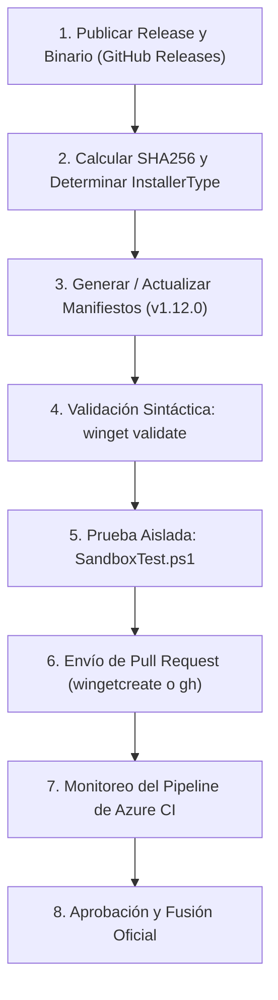

# Winget Package Publishing & Validation Skill

Esta skill proporciona las directivas maestras, flujos de trabajo estandarizados, plantillas y herramientas de diagnóstico para empaquetar, validar localmente, probar en Windows Sandbox y enviar aplicaciones al repositorio oficial de **Microsoft Winget** ([`microsoft/winget-pkgs`](https://github.com/microsoft/winget-pkgs)).

---

## 🏛️ 1. Estructura Oficial del Manifiesto Multi-Archivo (v1.12.0)

La versión recomendada del esquema oficial de Microsoft Winget es **v1.12.0**.
Cada versión de una aplicación **DEBE** organizarse en formato multi-archivo dentro de la jerarquía canónica estricta (distingue mayúsculas y minúsculas):

```
manifests/<primera_letra_publisher_minuscula>/<Publisher>/<PackageName>/<PackageVersion>/
├── <PackageIdentifier>.yaml
├── <PackageIdentifier>.installer.yaml
└── <PackageIdentifier>.locale.<Locale>.yaml
```

> **Ejemplo:** Para `PackageIdentifier: mininh.ConfiguradorWindows11` versión `1.0.0`:
> Ruta: `manifests/m/mininh/ConfiguradorWindows11/1.0.0/`
> - `mininh.ConfiguradorWindows11.yaml` (Manifiesto de Versión)
> - `mininh.ConfiguradorWindows11.installer.yaml` (Manifiesto de Instaladores)
> - `mininh.ConfiguradorWindows11.locale.es-ES.yaml` (Manifiesto de Metadatos y Localización)

---

## 🚀 2. Ciclo de Publicación Paso a Paso



### Paso 1: Verificar el Release y los Enlaces Públicos
- El instalador o binario (`.exe`, `.msi`, `.zip`) debe estar alojado en una URL pública, estable e inmutable (ejemplo: GitHub Releases con tag fijo `https://github.com/<user>/<repo>/releases/download/v<version>/<archivo>`).
- **NUNCA** utilices URLs dinámicas o "vanity URLs" que redirijan a la última versión mutable (causará `Error-Hash-Mismatch` en el CI).

### Paso 2: Calcular el Hash Criptográfico SHA256
Calcula el hash exacto del archivo remoto o local:
```powershell
winget hash <ruta_al_archivo>
# O en PowerShell nativo:
(Get-FileHash -Path <ruta_al_archivo> -Algorithm SHA256).Hash
```

### Paso 3: Generar los Manifiestos
Puedes generar el andamiaje inicial mediante `wingetcreate`:
```powershell
wingetcreate new <URL_del_instalador>
```
O escribirlos manualmente basándote en las plantillas oficiales en [references/manifest-templates.md](file:///.agents/skills/winget-publish/references/manifest-templates.md).

#### Elección de `InstallerType`:
- **`portable`**: Para binarios `.exe` autónomos (ej. PyInstaller, Go, Rust) que se ejecutan directamente sin asistente de instalación. Winget creará automáticamente symlinks en el `PATH` del usuario (`%LOCALAPPDATA%\Microsoft\WinGet\Links`).
- **`zip`**: Para paquetes comprimidos conteniendo ejecutables. Debe incluir `NestedInstallerType: portable` y `NestedInstallerFiles`.
- **`inno` / `nullsoft` / `wix` / `burn` / `msi` / `msix`**: Para instaladores convencionales. Deben incluir flags de instalación silenciosa (`Silent`, `SilentWithProgress`).

---

## 🧪 3. Validación y Pruebas en Windows Sandbox

### 3.1 Validación de Esquema Local (`winget validate`)
Ejecuta la validación oficial de Microsoft en el directorio del manifiesto:
```powershell
winget validate --manifest <ruta_al_directorio_de_la_version>
```
> [!IMPORTANT]
> El manifiesto debe pasar con **0 errores y 0 advertencias**. Si aparece una advertencia de silent switches en un binario portable, cambia `InstallerType: exe` a `InstallerType: portable`.

### 3.2 Prueba Aislada con `SandboxTest.ps1`
Para probar la instalación real sin alterar el sistema operativo anfitrión:
1. Asegúrate de tener Windows Sandbox habilitado:
   ```powershell
   Enable-WindowsOptionalFeature -FeatureName "Containers-DisposableClientVM" -All -Online
   ```
2. Clona el fork oficial de `winget-pkgs`:
   ```powershell
   git clone https://github.com/<tu_usuario>/winget-pkgs.git
   cd winget-pkgs\Tools
   ```
3. Ejecuta la prueba en sandbox:
   ```powershell
   .\SandboxTest.ps1 <ruta_absoluta_al_manifiesto>
   ```
   *El script valida el manifiesto, levanta una instancia efímera de Windows Sandbox, inyecta Winget y prueba la instalación y desinstalación completa del paquete.*

---

## 📤 4. Envío de Pull Request a `microsoft/winget-pkgs`

### Método A: Envío Automatizado con `wingetcreate`
```powershell
wingetcreate submit <ruta_al_directorio_del_manifiesto>
```
`wingetcreate` solicitará un Personal Access Token (PAT) de GitHub con alcance `repo` y creará automáticamente el fork, la rama y el Pull Request.

### Método B: Envío Manual con GitHub CLI (`gh`)
1. Crea una rama limpia en tu fork de `winget-pkgs`:
   ```powershell
   cd winget-pkgs
   git checkout master
   git pull upstream master
   git checkout -b add-<package-id>-<version>
   ```
2. Copia la carpeta `manifests/<letra>/<Publisher>/<PackageName>/<Version>/` a tu rama.
3. Haz commit y push:
   ```powershell
   git add manifests/
   git commit -m "New package: <PackageIdentifier> version <PackageVersion>"
   git push -u origin add-<package-id>-<version>
   ```
4. Abre el PR hacia `microsoft/winget-pkgs:master`:
   ```powershell
   gh pr create --repo microsoft/winget-pkgs --title "New package: <PackageIdentifier> version <PackageVersion>" --body "Package submission for <PackageIdentifier>"
   ```

> [!WARNING]
> **Reglas estrictas de PR en Winget:**
> - **1 solo paquete y 1 sola versión por Pull Request**. No mezcles múltiples versiones o paquetes.
> - No incluyas modificaciones a archivos fuera de `manifests/`.
> - Firma el Contributor License Agreement (CLA) cuando el bot de Microsoft lo solicite en el PR.

---

## 🔍 5. Diagnóstico del Pipeline de CI y Resolución de Errores

Consulta la guía exhaustiva en [references/validation-failures.md](file:///.agents/skills/winget-publish/references/validation-failures.md) para resolver etiquetas de error de Azure Pipelines:

| Etiqueta | Causa Principal | Solución |
| :--- | :--- | :--- |
| `Manifest-Validation-Error` | Sintaxis YAML rota o campos obligatorios ausentes | Ejecutar `winget validate` y corregir según esquema v1.12.0 |
| `Manifest-Path-Error` | Nombre de carpeta/archivo no coincide exactamente con `PackageIdentifier` (case-sensitive) | Verificar que la ruta sea `manifests/<letra>/<Publisher>/<PackageName>/<Version>/` |
| `Binary-Validation-Error` | Falso positivo de SmartScreen / Antivirus o SHA256 incorrecto | Enviar reporte de falso positivo a Defender o recalcular SHA256 |
| `Error-Hash-Mismatch` | El hash declarado no coincide con el archivo descargado | Usar URL fija con tag y recalcular `InstallerSha256` con `winget hash` |
| `Needs-CLA` | No se ha firmado el acuerdo de licencia de Microsoft | Seguir el enlace del bot en el PR y firmar el CLA con la cuenta de GitHub |
| `Azure-Pipeline-Passed` | Pruebas automatizadas superadas con éxito | Esperar la revisión manual de los moderadores de Microsoft |

---

## 📚 6. Referencias y Herramientas

- [Catálogo de Errores de Validación CI](file:///.agents/skills/winget-publish/references/validation-failures.md)
- [Guía de Pruebas con SandboxTest.ps1](file:///.agents/skills/winget-publish/references/sandbox-testing.md)
- [Plantillas YAML Oficiales de Manifiestos](file:///.agents/skills/winget-publish/references/manifest-templates.md)
- Script de validación local: `python .agents/skills/winget-publish/scripts/validate_manifest.py <ruta_manifiesto>`
