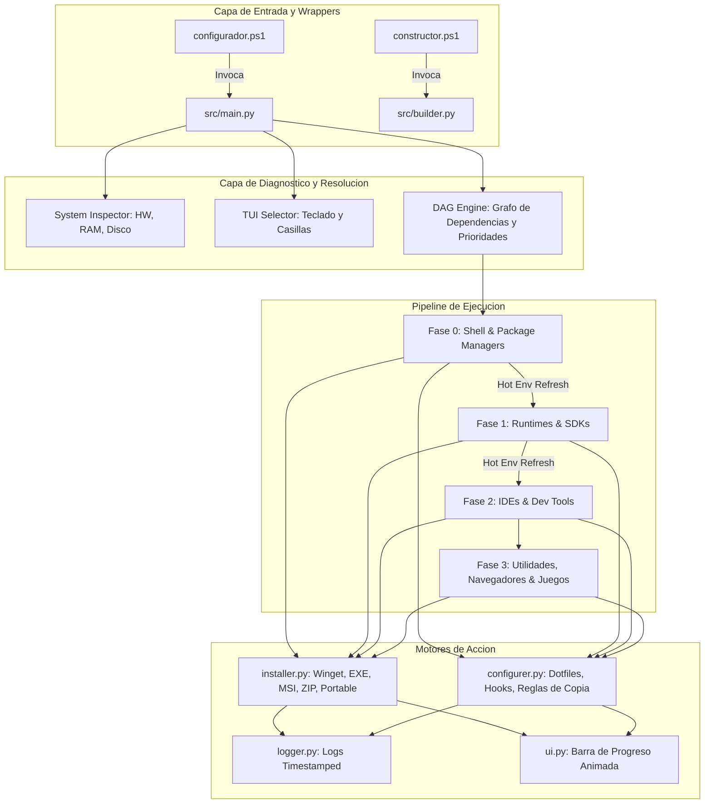

# Plan Maestro de Desarrollo, Mantenimiento y Arquitectura

Este documento establece la **hoja de ruta integral (Roadmap)**, los **estándares de mantenimiento**, las **estrategias de refactorización** y las **directivas de ejecución para futuros agentes** en el proyecto **Windows 11 Configurator**.

---

## 🎯 1. Filosofía del Proyecto y Reglas Inviolables

1. **Seguridad Absoluta (Zero-Risk Guarantee):**
   - Las pruebas automatizadas **NUNCA** deben modificar ni sobreescribir archivos reales del sistema operativo del usuario.
   - Toda prueba de inyección de configuraciones, dotfiles o resolución de variables debe ejecutarse en sandboxes temporales (`tempfile.TemporaryDirectory()`).
2. **Desarrollo Guiado por Pruebas (TDD):**
   - Cada aplicación o componente añadido debe incluir pruebas que validen su esquema JSON, la existencia física de sus archivos en `files/`, la resolución de sus variables y la ausencia de ciclos de dependencias en el grafo (DAG).
3. **Memoria Activa & Preguntas Abiertas:**
   - Cuando el usuario use expresiones como *"recuerda"*, registrar la decisión en [AGENTS.md](file:///a:/Proyectos/windows-config/AGENTS.md).
   - Ante cualquier dilema técnico o decisión de arquitectura/diseño, formular **preguntas abiertas** al usuario antes de implementar.

---

## 🏗️ 2. Arquitectura del Sistema



---

## 🗺️ 3. Fases de Implementación del Catálogo de Aplicaciones

### ✅ Fase 0: Shell, Terminal y Herramientas Base (Completada)
- [x] **`ohmyposh`** (P0): Motor de prompt con tema `darkside.omp.json`.
- [x] **`everything`** (P0): Voidtools Everything con servicio de indexación rápida.
- [x] **`powershell`** (P0): PowerShell 7, perfil con `Terminal-Icons`, `PSReadLine` ListView y `Get-NativeDir`.
- [x] **`git`** (P0): Git for Windows con `.gitconfig` global (alias, soporte longpaths, rama `main`).
- [x] **`powertoys`** (P3): Microsoft PowerToys.
- [x] **`everything_powertoys`** (P3): Plugin `lin-ycv.EverythingPowerToys` (DAG: depende de `powertoys` y `everything`).

---

### ⏳ Fase 1: Lenguajes de Programación, SDKs y Runtimes (Prioridad 1)
*Objetivo: Dejar los compiladores e intérpretes listos en PATH y con sus variables de entorno de sistema configuradas.*

1. **`python`**:
   - *Instalación:* Winget `Python.Python.3.13`.
   - *Configuración Directa:* Comprobación de adición a PATH, actualización de pip e instalación de paquetes base (`virtualenv`, `ruff`, `pytest`).
2. **`nodejs`**:
   - *Instalación:* Winget `OpenJS.NodeJS.LTS`.
   - *Configuración Directa:* Configuración de prefijo global npm en carpeta de usuario para evitar requerir permisos de administrador en `npm i -g`.
3. **`java`**:
   - *Instalación:* Winget `Oracle.JDK.21` o `EclipseAdoptium.Temurin.21.JDK`.
   - *Configuración Directa:* Registro automático de la variable de entorno `JAVA_HOME`.
4. **`rust`**:
   - *Instalación:* Winget `Rustlang.Rustup`.
   - *Configuración Directa:* Ejecución desatendida de `rustup default stable`.
5. **`go`**:
   - *Instalación:* Winget `GoLang.Go`.
   - *Configuración Directa:* Configuración de variables de entorno `GOPATH` y `GOROOT`.
6. **`flutter`**:
   - *Instalación:* Winget / Zip extraction.
   - *Configuración Directa:* Definición de `FLUTTER_HOME` y comprobación en PATH.
7. **`php`**:
   - *Instalación:* Winget / Zip extraction.
   - *Configuración Directa:* Plantilla `php.ini` base y adición a PATH.
8. **`c_cpp`**:
   - *Instalación:* Winget `MSYS2.MSYS2` o MinGW-w64.
   - *Configuración Directa:* Registro de `gcc`/`g++` en PATH.

---

### ⏳ Fase 2: IDEs, Editores y Herramientas Dev (Prioridad 2)
*Objetivo: Desplegar extensiones, configuraciones JSON de editores y herramientas locales de IA / Docker.*

1. **`vscode`**:
   - *Configuración Directa:* Despliegue de `settings.json`, `keybindings.json` e instalación de extensiones recomendadas (`code --install-extension ...`).
2. **`antigravity`**:
   - *Configuración Directa:* Inyección de plugins, configuraciones de agentes y atajos.
3. **`docker_desktop`**:
   - *Configuración Directa:* Habilitación de integración WSL2 y límites de memoria.
4. **`claude_code`** (DAG: depende de `nodejs`):
   - *Configuración Directa:* Verificación de CLI npm global.
5. **`lm_studio`** & **`ollama`**:
   - *Configuración Directa:* Registro de variable `OLLAMA_MODELS` y rutas de modelos en disco secundario (`D:` / `E:`).
6. **`dbeaver`**:
   - *Configuración Directa:* Plantillas de drivers JDBC y tema visual.
7. **`arduino_ide`** & **`unity_hub`** & **`android_studio`**:
   - *Configuración Directa:* Definición de rutas de SDK y proyectos en disco secundario.

---

### ⏳ Fase 3: Productividad, Navegadores y Virtualización (Prioridad 2 - 3)

1. **`brave`** & **`chrome`**:
   - Despliegue de políticas de privacidad y marcadores base.
2. **`obsidian`**:
   - Despliegue de plantillas, temas CSS y plugins esenciales.
3. **`wsl2`**:
   - Instalación de Ubuntu y configuración de `.wslconfig` para optimización de recursos.
4. **`vmware`** & **`virtualbox`**:
   - Soporte para instalador local EXE en `instaladores/` y carpeta de VMs en disco secundario.

---

### ⏳ Fase 4: Utilidades del Sistema, Periféricos y Juegos (Prioridad 3)

1. **Utilidades:** `7zip`, `winrar`, `keepassxc`, `blender`, `orcaslicer`, `crealityprint`, `cura`, `logitechghub`, `nvidiaapp`, `quickshare`.
2. **Juegos y Launchers:** `playnite` (con biblioteca unificada), `steam` (biblioteca en disco secundario), `epic_games`, `gog_galaxy`, `ea_app`, `ubisoft`, `xbox`, `ppsspp`.

---

## 🔧 4. Plan de Mantenimiento y Refactorización

### 4.1 Refactorización del Creador de Aplicaciones (`src/builder.py`) — ✅ COMPLETADO
- **Implementación:**
  1. Búsqueda unificada multi-repositorio (Winget 1º, Chocolatey 2º, Scoop 3º).
  2. Detección e importación automática de instaladores manuales locales desde ruta física (`.exe`, `.msi`, `.zip`, `.portable`).
  3. Selección asistida de prioridades y dependencias DAG desde el catálogo activo.
  4. Asistente para importar dotfiles y archivos existentes del equipo a `files/`.
  5. Ejecución inmediata de suite TDD para validar que la nueva app es 100% válida y segura antes de cerrar el asistente.

### 4.2 Script de Sincronización Inversa de Dotfiles (`src/core/sync_dotfiles.py`) — ✅ COMPLETADO
- **Implementación:**
  1. Escaneo automático de dotfiles y archivos configurados en `apps/` comparándolos con las rutas vivas del sistema host (`$HOME`, `$APPDATA`, etc.).
  2. Detección de archivos modificados/nuevos y menú interactivo TUI con checkboxes `[ ]`/`[x]` (tecla Espacio).
  3. Copia segura unidireccional (Sistema $\rightarrow$ Repositorio `files/`) sin modificar el sistema host.
  4. Ejecución mediante:
     ```powershell
     .\constructor.ps1 -SyncFromSystem
     # o bien
     python src/builder.py --sync-from-system
     ```

### 4.3 Actualización Continua de Paquetes
- Comprobación periódica de identificadores de Winget y validación de sintaxis de manifiestos con `python -m unittest discover -s tests`.

---

## 📋 5. Guía de Ejecución para Futuros Agentes

Cuando un agente retome el proyecto, debe seguir rigurosamente este checklist:

1. **Leer la Memoria Activa:** Consultar [AGENTS.md](file:///a:/Proyectos/windows-config/AGENTS.md) (Sección 9) para entender todas las decisiones previas.
2. **Ejecutar Pruebas Base:** Correr `python -m unittest discover -s tests` para verificar que el repositorio está en estado verde.
3. **Seguir el Skill `add-app`:** Al crear o modificar aplicaciones, estructurar la carpeta en `apps/<cat>/<app_id>/`, definir `priority` y `depends_on`, y validar con tests aislados seguros.
4. **Validación Visual:** Comprobar el orden DAG ejecutando `python src/main.py --dry-run --test-mode`.
5. **Actualizar el Checklist:** Marcar como `[x]` en [aplicaciones.md](file:///a:/Proyectos/windows-config/aplicaciones.md) las aplicaciones que se vayan implementando y verificando.
