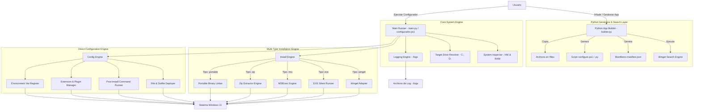
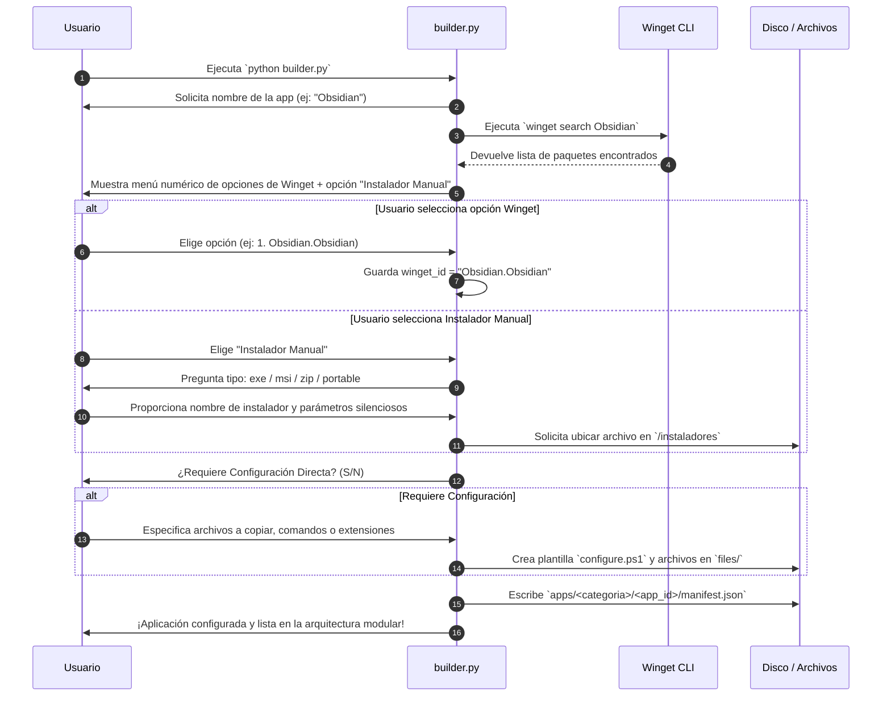
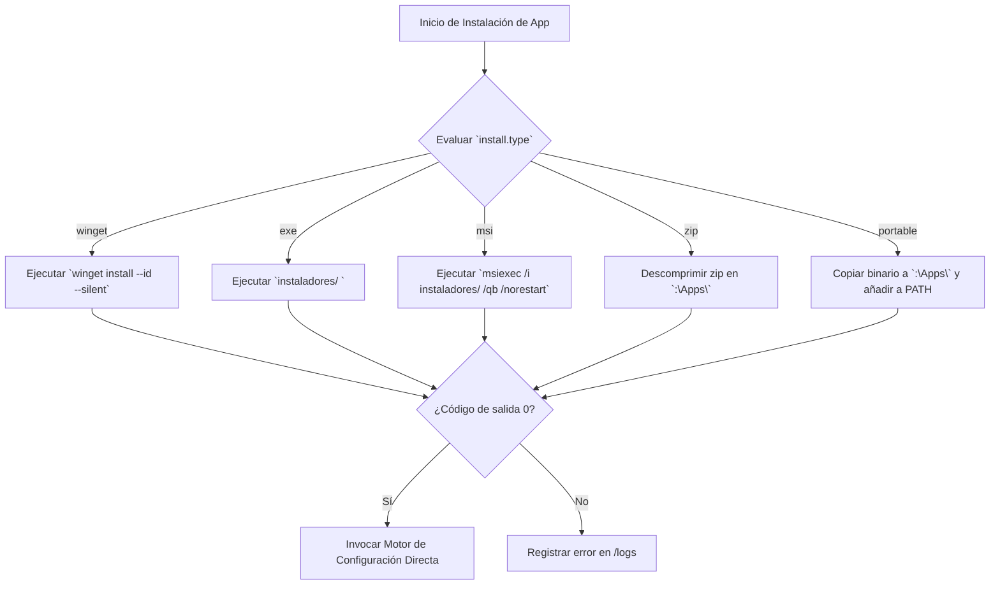

# Arquitectura del Sistema: Configurador de Windows 11

El **Configurador de Windows 11** adopta una arquitectura híbrida y modular (PowerShell & Python) orientada a componentes. Permite la automatización completa de la instalación de software y la inyección directa de configuraciones de usuario, integrando un **Generador e Inspector Interactivo en Python** (`builder.py`) para gestionar fácilmente nuevas aplicaciones.

---

## 1. Visión General de la Arquitectura



---

## 2. Estructura de Directorios del Proyecto

```
windows-config/
├── configurador.ps1             # Orquestador principal en PowerShell
├── main.py                      # Orquestador principal en Python
├── builder.py                   # Generador interactivo de apps en Python (CLI Manager)
│
├── requisitos.md                # Documento de requisitos del sistema
├── arquitectura.md              # Documento de arquitectura del sistema
├── aplicaciones.md              # Matriz y checklist de aplicaciones
│
├── core/                        # Módulos centrales del motor
│   ├── SystemInspector.ps1      # Diagnóstico HW, RAM y espacio en disco
│   ├── TargetDriveResolver.ps1  # Resolución de unidades y rutas (C:, D:, etc.)
│   ├── InstallEngine.ps1        # Engine de instalación multitipo (winget, exe, msi, zip)
│   ├── ConfigEngine.ps1         # Engine de desplegado de archivos y hooks
│   └── LoggerEngine.ps1         # Subsistema de registro de auditoría en /logs
│
├── pycore/                      # Módulos centrales en Python
│   ├── winget_search.py         # Motor de búsqueda e integración con Winget CLI
│   ├── app_builder.py           # Asistente de creación guiada de manifiestos
│   ├── installer.py             # Ejecutor de instaladores multitipo en Python
│   └── configurer.py            # Desplegador de configuraciones directas en Python
│
├── apps/                        # Definiciones modulares por categorías
│   ├── ux_ui/
│   │   ├── powershell/
│   │   │   ├── manifest.json    # Manifiesto normalizado
│   │   │   ├── configure.ps1    # Script hook post-instalación
│   │   │   └── files/           # Archivos estáticos de configuración
│   │   │       ├── Microsoft.PowerShell_profile.ps1
│   │   │       ├── darkside.omp.json
│   │   │       └── powershell.config.json
│   │   └── windhawk/
│   ├── ides/
│   ├── herramientas/
│   └── utilidades/
│
├── instaladores/                # Binarios locales fallback (.exe, .msi, .zip)
└── logs/                        # Registros de ejecución timestamped (.log)
```

---

## 3. Especificación del Esquema del Manifiesto (`manifest.json`)

Cada aplicación dentro de `apps/<categoria>/<app_id>/` cuenta con un archivo `manifest.json` que define de forma exhaustiva sus metadatos de instalación y configuración:

```json
{
  "id": "vscode",
  "name": "Visual Studio Code",
  "category": "ides",
  "install": {
    "type": "winget",
    "winget_id": "Microsoft.VisualStudioCode",
    "local_installer": null,
    "silent_args": "/verysilent /suppressmsgboxes",
    "check_command": "code",
    "target_drive_supported": true,
    "zip_extract_subpath": null
  },
  "requirements": {
    "MinRAM_GB": 4.0,
    "MinDisk_GB": 1.5,
    "RequireAdmin": false
  },
  "config": {
    "has_direct_config": true,
    "files": [
      {
        "source": "settings.json",
        "destination": "$env:APPDATA/Code/User/settings.json",
        "create_backup": true
      }
    ],
    "commands": [
      "code --install-extension ms-python.python",
      "code --install-extension eamodio.gitlens"
    ],
    "environment_vars": {
      "EDITOR": "code"
    }
  }
}
```

### Explicación de los Atributos del Manifiesto:

#### Objeto `install`:
- **`type`**: `winget` | `exe` | `msi` | `zip` | `portable` | `script`.
- **`winget_id`**: Cadena con la ID exacta en Winget (ej. `Microsoft.VisualStudioCode`).
- **`local_installer`**: Nombre del archivo binario ubicado en `instaladores/` (ej. `VMware-workstation-full.exe`).
- **`silent_args`**: Argumentos de consola para la instalación desatendida del instalador ejecutable (`/S`, `/quiet`, `/qn`).
- **`check_command`**: Nombre del ejecutable o comando CLI para verificar si la app ya está instalada.
- **`target_drive_supported`**: `true` si la instalación o descompresión puede redirigirse a un disco secundario (ej. `D:\Apps`).

#### Objeto `config`:
- **`has_direct_config`**: Booleano que indica si la app requiere personalización post-instalación.
- **`files`**: Matriz de reglas de copia de archivos desde `files/` hacia el sistema, especificando origen, destino con variables de entorno (`$HOME`, `$env:APPDATA`) y copia de seguridad `.bak`.
- **`commands`**: Lista de comandos de consola o scripts a ejecutar tras completar la instalación.
- **`environment_vars`**: Clave-valor de variables de entorno a registrar en el sistema/usuario.

---

## 4. Asistente Interactivo en Python (`builder.py`)

El script `builder.py` actúa como la interfaz de creación y gestión de aplicaciones.



---

## 5. Manejo de Instaladores Multitipo en el Motor de Ejecución


